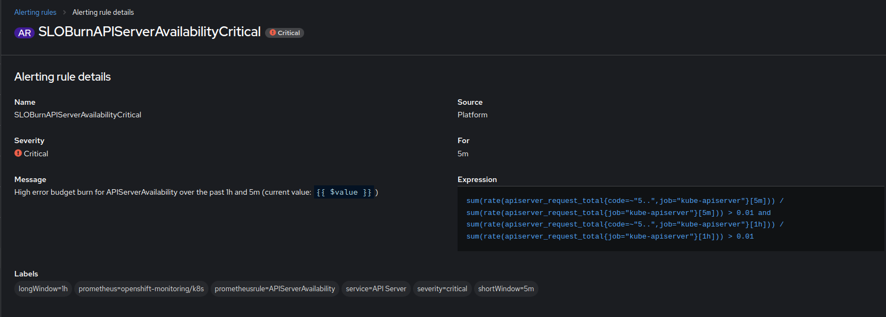

# SLO Burn

SLO Burn is the missing abstraction layer to simplify and solidify the creation of SLO-based alerts.

Turn your error budget alerts into Go code and never care about the details again.

## SLO Definition

Define a Service Level Objective (SLO) using Go code by setting a target availability and the input PromQL formula that calculates the SLI.

## Multiwindow Multi-Burn-Rate Alerts

That's what SLO Burn will generate for you. It's most likely non-readable PromQL which is why you won't want to craft it by hand.

## Example of a Generated Set of Alerts

See example/burnalert. Current state:

Go code:

```go
package main

import (
	"fmt"

	"github.com/NautiluX/sloburn"
)

const WindowPlaceHolder string = ":window:"
const queryGood string = "sum(rate(apiserver_request_total{job=\"kube-apiserver\", code=~\"5..\"}[" + WindowPlaceHolder + "]))"
const queryValid string = "sum(rate(apiserver_request_total{job=\"kube-apiserver\"}[" + WindowPlaceHolder + "]))"

func main() {
	alert := sloburn.NewBurnAlert(
		"APIServerAvailability",
		queryGood,
		queryValid,
		99.0,
		map[string]string{"prometheus": "prometheus-k8s"},
	)
	alert.AddAlertLabels(map[string]string{"service": "API Server"})
	fmt.Println(alert.CompilePrometheusRuleString())
}

```

Output:

```json
{
  "kind": "PrometheusRule",
  "apiVersion": "monitoring.coreos.com/v1",
  "metadata": {
    "name": "APIServerAvailability",
    "creationTimestamp": null,
    "labels": {
      "prometheus": "prometheus-k8s"
    }
  },
  "spec": {
    "groups": [
      {
        "name": "slo-rules",
        "rules": [
          {
            "alert": "SLOBurnAPIServerAvailabilityCritical",
            "expr": "sum(rate(apiserver_request_total{job=\"kube-apiserver\", code=~\"5..\"}[5m]))/sum(rate(apiserver_request_total{job=\"kube-apiserver\"}[5m])) \u003e 0.010 and sum(rate(apiserver_request_total{job=\"kube-apiserver\", code=~\"5..\"}[1h]))/sum(rate(apiserver_request_total{job=\"kube-apiserver\"}[1h])) \u003e 0.010",
            "for": "5m",
            "labels": {
              "longWindow": "1h",
              "prometheusrule": "APIServerAvailability",
              "service": "API Server",
              "severity": "critical",
              "shortWindow": "5m"
            },
            "annotations": {
              "message": "High error budget burn for APIServerAvailability over the past 1h and 5m (current value: {{ $value }})"
            }
          },
          {
            "alert": "SLOBurnAPIServerAvailabilityCritical",
            "expr": "sum(rate(apiserver_request_total{job=\"kube-apiserver\", code=~\"5..\"}[30m]))/sum(rate(apiserver_request_total{job=\"kube-apiserver\"}[30m])) \u003e 0.010 and sum(rate(apiserver_request_total{job=\"kube-apiserver\", code=~\"5..\"}[6h]))/sum(rate(apiserver_request_total{job=\"kube-apiserver\"}[6h])) \u003e 0.010",
            "for": "5m",
            "labels": {
              "longWindow": "6h",
              "prometheusrule": "APIServerAvailability",
              "service": "API Server",
              "severity": "critical",
              "shortWindow": "30m"
            },
            "annotations": {
              "message": "High error budget burn for APIServerAvailability over the past 6h and 30m(current value: {{ $value }})"
            }
          },
          {
            "alert": "SLOBurnAPIServerAvailabilityWarning",
            "expr": "sum(rate(apiserver_request_total{job=\"kube-apiserver\", code=~\"5..\"}[3h]))/sum(rate(apiserver_request_total{job=\"kube-apiserver\"}[3h])) \u003e 0.010 and sum(rate(apiserver_request_total{job=\"kube-apiserver\", code=~\"5..\"}[24h]))/sum(rate(apiserver_request_total{job=\"kube-apiserver\"}[24h])) \u003e 0.010",
            "for": "1h",
            "labels": {
              "longWindow": "24h",
              "prometheusrule": "APIServerAvailability",
              "service": "API Server",
              "severity": "warning",
              "shortWindow": "3h"
            },
            "annotations": {
              "message": "Moderate error budget burn for APIServerAvailability over the past 24h and 3h(current value: {{ $value }})"
            }
          },
          {
            "alert": "SLOBurnAPIServerAvailabilityWarning",
            "expr": "sum(rate(apiserver_request_total{job=\"kube-apiserver\", code=~\"5..\"}[6h]))/sum(rate(apiserver_request_total{job=\"kube-apiserver\"}[6h])) \u003e 0.010 and sum(rate(apiserver_request_total{job=\"kube-apiserver\", code=~\"5..\"}[3d]))/sum(rate(apiserver_request_total{job=\"kube-apiserver\"}[3d])) \u003e 0.010",
            "for": "1h",
            "labels": {
              "longWindow": "3d",
              "prometheusrule": "APIServerAvailability",
              "service": "API Server",
              "severity": "warning",
              "shortWindow": "6h"
            },
            "annotations": {
              "message": "Moderate error budget burn for APIServerAvailability over the past 6h and 3d (current value: {{ $value }})"
            }
          }
        ]
      }
    ]
  }
}
```

## Example: Deploying Alerts to Kubernetes Directly

Prerequisite is an installed Cluster Monitoring Operator (e.g. using an OpenShift cluster).

See example/client-go. Current state:

Go code:

```go
package main

import (
	"github.com/NautiluX/sloburn"
)

const WindowPlaceHolder string = ":window:"
const queryGood string = "sum(rate(apiserver_request_total{job=\"kube-apiserver\", code=~\"5..\"}[" + WindowPlaceHolder + "]))"
const queryValid string = "sum(rate(apiserver_request_total{job=\"kube-apiserver\"}[" + WindowPlaceHolder + "]))"

func main() {
	alert := sloburn.NewBurnAlert(
		"APIServerAvailability",
		queryGood,
		queryValid,
		99.0,
		map[string]string{"prometheus": "k8s"},
	)
	alert.AddAlertLabels(map[string]string{"service": "API Server"})
	alert.SetNamespace("openshift-monitoring")
	sloburn.UpsertAlertsKube(&alert)
}
```

Screenshot from OpenShift console:



## Example: Reconcile Alerts in a Cluster

See example/reconcile-alerts. Current state:

```go
package main

import (
	"time"

	"github.com/NautiluX/sloburn"
	"github.com/NautiluX/sloburn/alert"
)

func main() {
	reconcileAlerts(getActiveAlerts(), getOutdatedAlerts())
}

func reconcileAlerts(alerts, outdatedAlerts []alert.BurnAlert) {
	for {
		for _, a := range outdatedAlerts {
			sloburn.DeleteAlertsKube(&a)
		}
		for _, a := range alerts {
			sloburn.UpsertAlertsKube(&a)
		}
		time.Sleep(time.Second * 10)
	}
}

func getActiveAlerts() []alert.BurnAlert {
	alerts := []alert.BurnAlert{}
	alerts = append(alerts, getApiServerAlerts()...)
	return alerts
}

func getApiServerAlerts() []alert.BurnAlert {
	alerts := []alert.BurnAlert{}
	apiAlert := sloburn.NewBurnAlert(
		"APIServerAvailability",
		"sum(rate(apiserver_request_total{job=\"kube-apiserver\", code=~\"5..\"}[:window:]))",
		"sum(rate(apiserver_request_total{job=\"kube-apiserver\"}[:window:]))",
		99.0,
		map[string]string{"prometheus": "k8s"},
	)
	apiAlert.AddAlertLabels(map[string]string{"service": "API Server"})
	apiAlert.SetNamespace("openshift-monitoring")
	alerts = append(alerts, apiAlert)
	return alerts
}

func getOutdatedAlerts() []alert.BurnAlert {
	outdatedAlerts := []alert.BurnAlert{}
	outdatedAlerts = append(outdatedAlerts, sloburn.NewBurnAlertWithNamespace("default", "SomeOldSLO", "", "", 0, map[string]string{}))
	return outdatedAlerts
}

```
